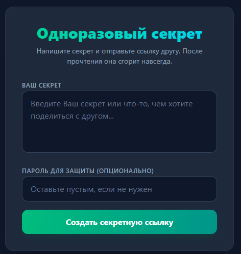
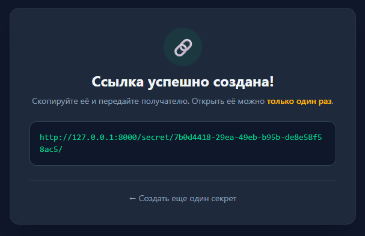
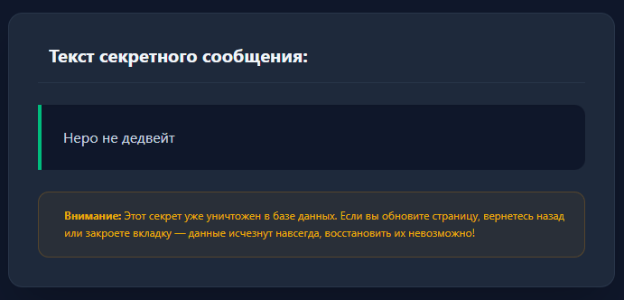

# Сервис одноразовых секретов.

* Позволяет создать одноразовый секрет, получить на него ссылку и поделиться с другом. После прочтения секрета, он сгорает, повторно посмотреть невозможно. На просмотр секрета можно поставить пароль.

## Технологический стек
* **Backend:** Python, Django
* **Database:** SQLite
* **Frontend:** HTML5, Tailwind CSS

##  Локальный запуск

1. Клонируйте репозиторий:
```bash
git clone git@github.com:Pashec/secrets_service.git
```
```bash
cd secrets_sevice
```
2. Создайте и активируйте виртуальное окружение:
```bash
python -m venv venv
```
```bash
# Для Windows
source venv/Scripts/activate
```
3. Установите зависимости :
```bash
pip install -r requirements.txt
```
4. Выполните миграции БД :
```bash
python manage.py migrate
```
5. Запустите локальный сервер
```bash
python manage.py runserver
```

После этого сервис будет доступен по адресу http://127.0.0.1:8000/


##  Общий вид сервиса :

1. Вид создания секрета: 
2. Вид удачного создания и получения ссылки: 
3. Вид перехода по ссылке-секрету: 